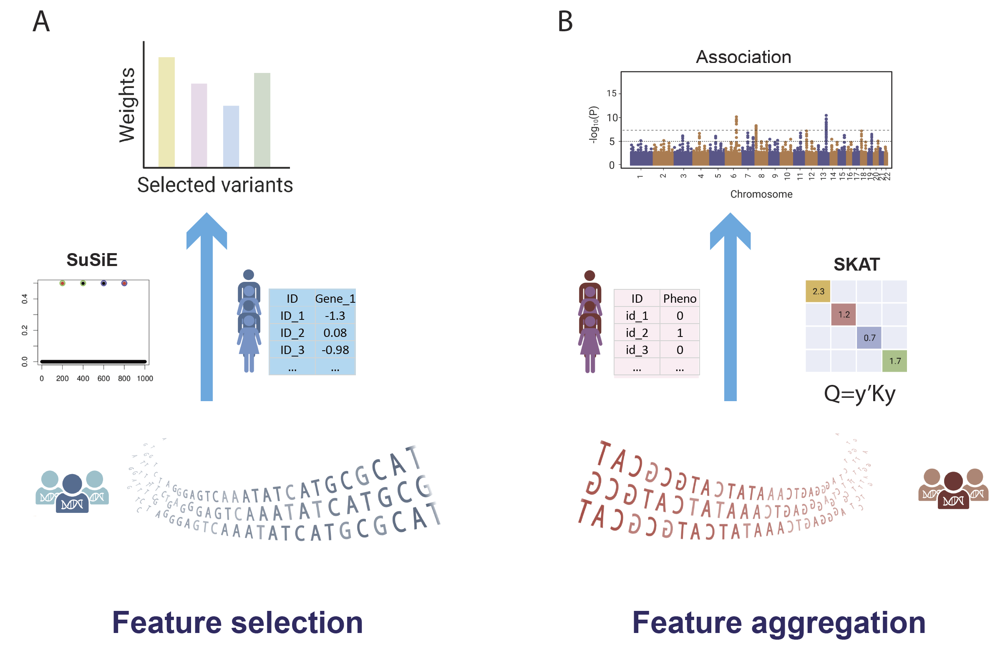

## Users’ Manual of rvTWAS
### rvTWAS: 

### Installation
rvTWAS is a batteries-included JAR executable. All needed external jar packages are included in the downloadable, rvTWAS.jar. To download all necessary files, users can use the command 
`git clone XXXX`

As we used an R package "susieR" and "SKAT", the users have to install "R", "susieR"(https://cran.r-project.org/web/packages/susieR/susieR.pdf),and "SKAT"(https://cran.r-project.org/web/packages/SKAT/index.html). The versions of "R", "SuSiE", and "SKAT" packages that we have used on our platform are: version 3.6.1 for "R", version 0.12.35 for "susieR", and version 2.0.0 for "SKAT" Users are also expected to have java (version: 1.8) and Plink (version: 1.9) installed on their platform.

Usage:
rvTWAS, which is composed by two steps: First, rvTWAS uses SuSiE (\cite SuSiE) to carry out variants selections to form a prioritized set of genetic variants (including rare variants) weighted by their relevance to gene expressions (Figure 1A). Second, supported by our previous  successful attempt using kernel methods to carry out common variants-based TWAS (\cite kTWAS, mkTWAS), as well as the practice of using kernel models in both common and rare variants GWAS (\cite SKAT papers, both AJHG 2010 and 2011 and the other adaptive ones), we use SKAT method to aggregate weighted variants to form a score test for the association (Figure 1B). 

### 1. Feature selection using SuSiE[REF]:
#### 1.1 Prepare input data:
**1.1.1	Gene expression file:** \
Take the whole blood as an example. The fully processed, filtered and normalized gene expression matrices in bed format ("Whole_Blood.v8.normalized_expression.bed") for whole blood was downloaded from GTEx portal (https://gtexportal.org/home/datasets). We included 221 samples in our analysis and removed sex chromosomes. The covariates used in eQTL analysis, including top five genotyping principal components (PCs), were obtained from GTEx_Analysis_v8_eQTL_covariates.tar.gz, which was downloaded from GTEx portal (https://gtexportal.org/home/datasets). Then, we further performed a probabilistic estimation of expression residuals (PEER) analysis to adjust for top five genotyping PCs, age, and other potential confounding factors (PEERs)[2] for downstream prediction model building. There is a description of how to download and use the PEER tool here: https://github.com/PMBio/peer/wiki/Tutorial. According to the GTEx protocol, if the number of samples is between 150 and 250, 30 PEER factors should be used. For our study, the number of samples is 221, so we used 60 PEER factors. 

**1.1.2	genotype file:**  
The whole genome sequencing file, GTEx_Analysis_2017-06-05_v8_WholeGenomeSeq_866Indiv.vcf, was downloaded from dbGaP (https://www.ncbi.nlm.nih.gov/projects/gap/cgi-bin/study.cgi?study_id=phs000424.v8.p2). The genotype dataset is quality controlled using the tool PLINK [3] (https://zzz.bwh.harvard.edu/plink/ ). Multiple QC steps were applied by excluding variants with missingness rate > 0.1, high deviations from Hardy-Weinberg equilibrium at p<10-6, and removing samples with missingness rate > 0.1. To be noticed that, we include all common variants, low frequency variants and rare variants. 

The input genotype file ("genotype_file") with the format as below:

 CHR,LOC,GTEX-111CU,GTEX-111FC,GTEX-111YS,GTEX-117YW,GTEX-117YX, … … \
 1,933303,0,0,0,0,0,0,0,0,1,0,0,0,1,0,0,0,0,0,0,0,0,0,0,0,0,0,0,0,0,0,0,0, … … \
 1,933411,1,2,2,2,2,2,2,2,2,2,2,2,1,2,2,2,2,2,2,2,2,2,2,2,2,2,2,2,2,2,2,2,2, … … \
 1,933653,0,0,0,0,0,0,0,0,0,0,0,0,0,0,0,0,0,0,0,0,0,0,0,1,0,0,0,0,0,1,0,0,0, … … \
 … …

**1.1.3	SNP annotation file:** \
The input snp annotation file ("snp_annot_file"), contains annotations for all variants with the format as below (the same format as bim file): 
1       chr1_10291_C_T_b38      0       10291   T       C \
1       chr1_10291_C_T_b38      0       10291   T       C \
1       chr1_10419_T_C_b38      0       10419   C       T \
1       chr1_10423_C_G_b38      0       10423   G       C \
… …

**1.1.4	Gene annotation file:** \
The input gene annot file ("gene_annot_file") is downloaded from GENCODE: https://www.gencodegenes.org/human/release_26.html, in the GTF format and build in GRCh38.

**1.1.5	GWAS file:** \
The input GWAS file ("gwas_file") contains "CHR" and "POS" columns, we just need to make sure that all the SNPs being trained in the SuSiE model can be found in the GWAS dataset.

#### 1.2. Training SuSiE model:
We processed one chromosome at a time by executing this code, take chromsome 1 as an example:\
`Rscript ./CODE/Susie_Gene_Chr.R  1`

### 2. Feature aggregation using SKAT[REF]:
Running the command:

`java -jar rvTWAS.jar rvTWAS -format csv|plink -input_genotype INPUT_GENOTYPE_FILE -input_phenotype INPUT_PHENOTYPE_FILE -input_phenotype_column INPUT_PHENOTYPE_COLUMN_START:2|6 -input_phenotype_type PHENOTYPE_TYPE: continuous|binary -snp_info_path WEIGHT_FILE  -pheno_id INPUT_GENE_ID  -plink PLINK_BINARY_FILE_PATH  -Rscript RSCRIPT_BINARY_FILE_PATH -output_folder OUTPUT_FOLDER_PATH`

A simple example are described below. Users can get the final p-value result under the folder: OUTPUT_FOLDER_PATH. Take the function "LMM-Kernel" and IDP "25904-2.0" as an example:

#### 2.1. If trying csv format, the command line is:

`java -jar ./CODE/rvTWAS.jar rare-TWAS -format csv -input_genotype ./EXAMPLE/CSV_FORMAT/example.csv -input_phenotype ./EXAMPLE/CSV_FORMAT/example.tsv -input_phenotype_column 2 -input_phenotype_type binary -snp_info_path ./EXAMPLE/Susie_weights.txt -pheno_id ENSG00000239961.2 -plink /PATH/TO/plink -Rscript /PATH/TO/Rscript -output_folder /PATH/TO/OUT_FOLDER`

#### 2.2. If users want to try plink format, the command line is:

`java -jar ./CODE/rvTWAS.jar rare-TWAS -format plink -input_genotype ./EXAMPLE/PLINK_FORMAT/example.tped -input_phenotype ./EXAMPLE/PLINK_FORMAT/example.tfam -input_phenotype_column 6 -input_phenotype_type binary -snp_info_path ./EXAMPLE/Susie_weights.txt -pheno_id ENSG00000239961.2 -plink /PATH/TO/plink -Rscript /PATH/TO/Rscript -output_folder /PATH/TO/OUT_FOLDER`

Please note that, to consistent with plink format, the phenotype is set to missing (normally represented by -9) if unspecified. It must be a numeric value. Case/control phenotypes are normally coded as control = 1, case = 2.The rvTWAS.result under /PATH/TO/OUT_FOLDER is the final output file by rvTWAS.

### Contacts
  Jingni He: jingni.he1@ucalgary.ca 
  qingrun.zhang@ucalgary.ca 
  
### Citations

### Copyright License (MIT Open Source)
Permission is hereby granted, free of charge, to any person obtaining a copy of this software and associated documentation files (the "Software"), to deal in the Software without restriction, including without limitation the rights to use, copy, modify, merge, publish, distribute, sublicense, and/or sell copies of the Software, and to permit persons to whom the Software is furnished to do so, subject to the following conditions:

The above copyright notice and this permission notice shall be included in all copies or substantial portions of the Software. THE SOFTWARE IS PROVIDED "AS IS", WITHOUT WARRANTY OF ANY KIND, EXPRESS OR IMPLIED, INCLUDING BUT
NOT LIMITED TO THE WARRANTIES OF MERCHANTABILITY, FITNESS FOR A PARTICULAR PURPOSE AND NONINFRINGEMENT. IN NO EVENT SHALL THE
AUTHORS OR COPYRIGHT HOLDERS BE LIABLE FOR ANY CLAIM, DAMAGES OR OTHER LIABILITY, WHETHER IN AN ACTION OF CONTRACT, TORT OR
OTHERWISE, ARISING FROM, OUT OF OR IN CONNECTION WITH THE SOFTWARE OR THE USE OR OTHER DEALINGS IN THE SOFTWARE. 
